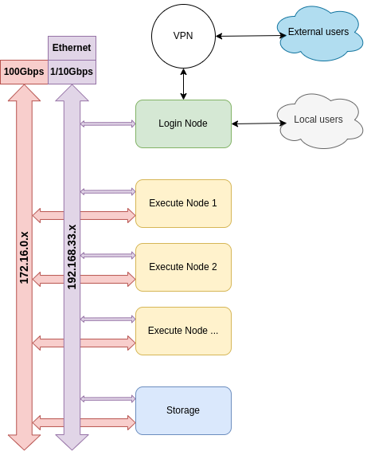

# Architecture

## Physical connection

- IP adresses:
    - Headnode: cluster-hn
        - br1: 192.168.33.5
        - br2: 172.16.0.5

    - Compute node: cluster-gn[1/2/3/..]
        - br0: 172.20.0.[`10 + Node ID`]
        - br1: 192.168.33.[`10 + Node ID`]
        - br2: 172.16.0.[`10 + Node ID`]

    - Virtual node: cluster-vgn[1/2/3/..]
        - br0: 172.20.0.[`100 + i`]
        - br1: 192.168.33.[`100 + i`]
        - br2: 172.16.0.[`100 + i`]
